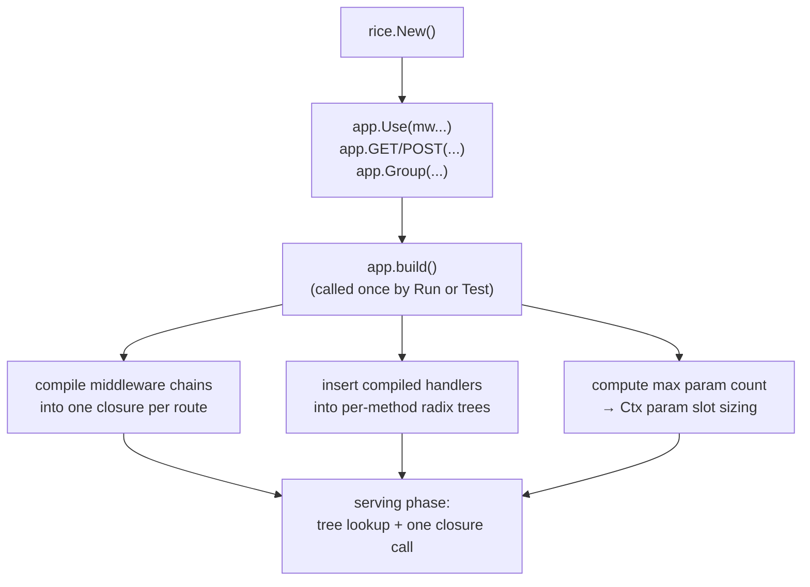
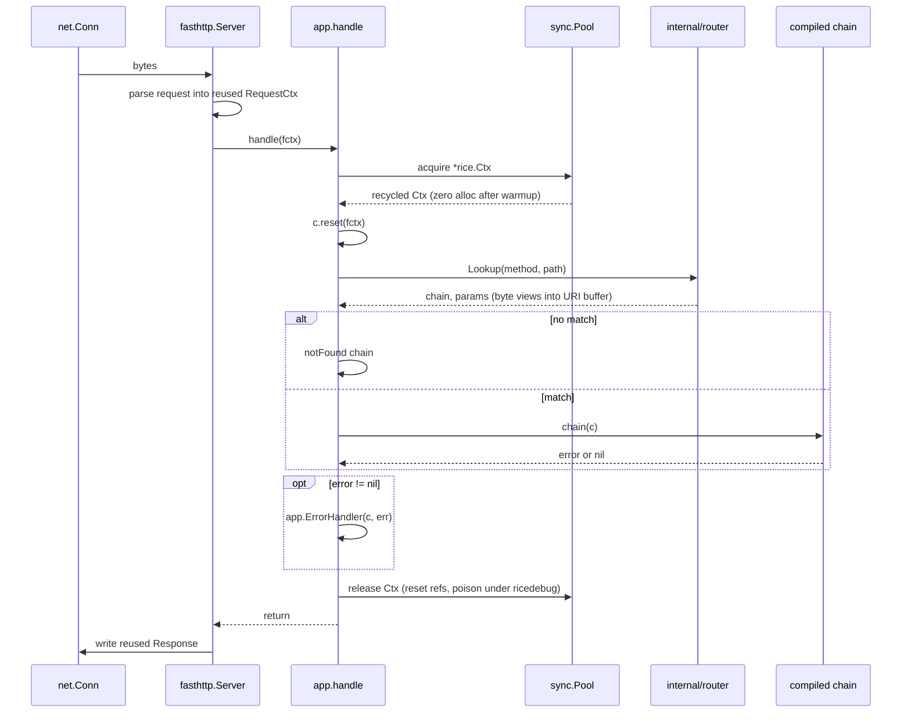

# 02 — Architecture

## Layers

Four layers, each depending only on the one below it. The dependency rule is enforced by
import restrictions: nothing under `internal/` may import package `rice`.

```
┌─────────────────────────────────────────────────────────┐
│  User code: handlers, middleware, route registrations   │
├─────────────────────────────────────────────────────────┤
│  rice — public API                                      │
│  App · Ctx · Handler · Middleware · Group · HTTPError    │
├─────────────────────────────────────────────────────────┤
│  internal/ — mechanism                                   │
│  router (radix tree) · chain (compiler) · bytesconv      │
├─────────────────────────────────────────────────────────┤
│  fasthttp — transport, parsing, connection lifecycle     │
└─────────────────────────────────────────────────────────┘
```

The public layer is deliberately thin: it is mostly a facade that names things well and
owns lifetimes. The interesting algorithms are one layer down, unexported, and free to
change.

## Package layout

```
rice-http/
├── app.go              App: construction, route registration, build, Run/Shutdown
├── ctx.go              Ctx: the pooled per-request handle
├── ctx_request.go      Ctx read side: params, query, headers, body
├── ctx_response.go     Ctx write side: status, headers, String/Bytes/JSON
├── handler.go          Handler, Middleware, MiddlewareFunc
├── group.go            Group: prefix and middleware scoping
├── error.go            HTTPError, ErrorHandler, defaultErrorHandler
├── pool.go             sync.Pool wiring, acquire/release, debug poisoning
├── server.go           fasthttp.Server construction, graceful shutdown, hooks
├── internal/
│   ├── router/         radix tree: insert, lookup, param capture, priority
│   ├── chain/          middleware chain compilation
│   └── bytesconv/      the only place unsafe string/[]byte views are allowed
├── middleware/         optional, opt-in: recover, logger, requestid, timeout
├── docs/               these documents
└── bench/              benchmark suite and recorded results
```

`middleware/` is a separate package on purpose. Importing rice must not drag in anything
a user did not ask for, and the import graph is the honest signal of what costs what.

## The two phases

rice has a **registration phase** and a **serving phase**, separated by an explicit build
step. Almost everything expensive happens in the first phase.



**Why a build step exists at all.** If chains were compiled at registration time, a
middleware added with `app.Use` *after* a route was registered would silently not apply to
it — a real and confusing bug that Gin and Fiber both have. Deferring compilation to a
single `build()` means registration order does not matter, and it also gives one clear
place to reject an invalid configuration before the socket is ever opened. `build()` runs
under `sync.Once`; registering a route after build panics with a clear message rather than
racing. See [ADR-0003](adr/0003-middleware-as-prebuilt-closure-chain.md).

## Request lifecycle



Three things to notice, because they are the whole design:

1. **Nothing in this path allocates on a warm server.** The `Ctx` comes from a pool, the
   parameters are slices into a buffer fasthttp already owns, and the chain is a single
   closure built long ago. The only allocations are ones the user's handler makes.
2. **There is exactly one error funnel.** Every failure — routing, middleware, handler —
   converges on `app.ErrorHandler`. That is the one place to change how the service reports
   problems.
3. **Release is unconditional.** It happens whether the handler returned, errored, or
   panicked, because that is what makes the pool safe.

## Router shape

One radix tree per HTTP method, held in a fixed-size array indexed by a method constant,
with a map fallback for uncommon verbs. Method dispatch is therefore an array index on the
hot path, not a map lookup or a string comparison.

```
trees[GET]  ── / ─┬─ "users/" ─┬─ ":id" ────── handler
                  │            └─ "search" ─── handler
                  └─ "health" ───────────────── handler
```

Match priority within a node is fixed and total, so there is never an ambiguity to resolve
at request time: **static > parameter (`:name`) > wildcard (`*path`)**. Conflicting routes
are rejected at registration with an error naming both patterns.
See [ADR-0004](adr/0004-radix-tree-router.md).

## Where the bytes live

This is the diagram worth internalising, because the borrow contract falls out of it.

```
fasthttp read buffer  [ GET /users/42 HTTP/1.1\r\nHost: ...\r\n\r\n ]
                              ▲     ▲
                              │     └── params[0].value  = []byte view, len 2
                              └──────── c.Path()         = []byte view
```

`c.Param("id")` hands back a `[]byte` that points into a buffer fasthttp will reuse for
the next request on that connection. It is correct and free during the handler, and it is
a use-after-free the instant the handler returns. `c.ParamString("id")` copies, costs one
allocation, and is safe forever. Both exist, both are documented with their cost, and the
naming makes the expensive one the longer one to type.
