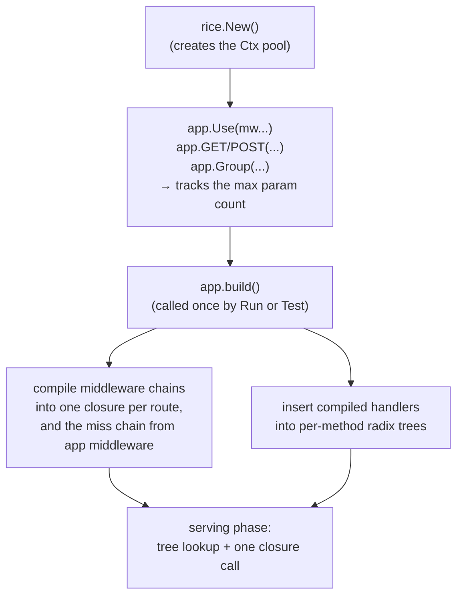
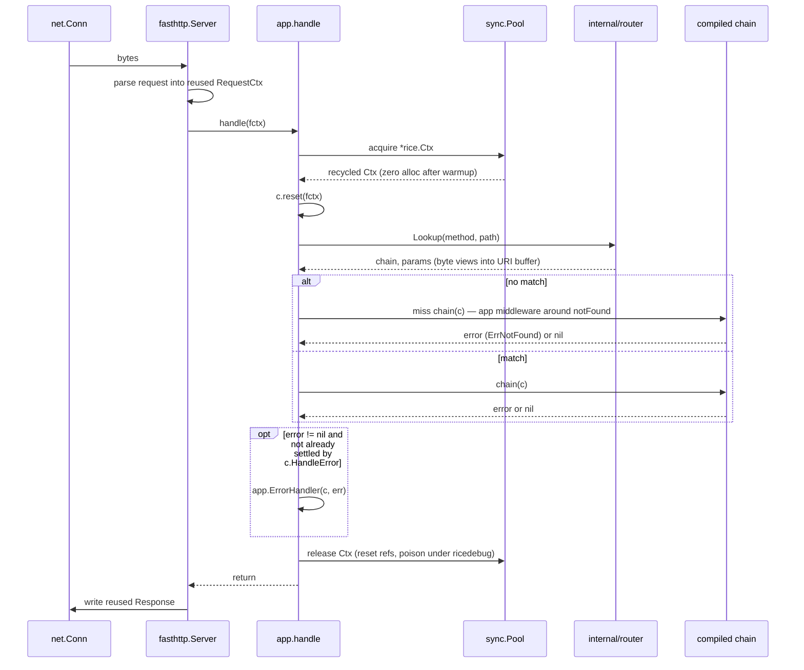

# 02 — Architecture

## Layers

Four layers, each depending only on the one below it. The dependency rule is enforced by
import restrictions: nothing under `internal/` may import package `rice`.

```
┌─────────────────────────────────────────────────────────┐
│  User code: handlers, middleware, route registrations   │
├─────────────────────────────────────────────────────────┤
│  rice — public API                                      │
│  App · Ctx · Handler · Middleware · Group · HTTPError    │
├─────────────────────────────────────────────────────────┤
│  internal/ — mechanism                                   │
│  router (radix tree) · chain (compiler) · bytesconv      │
├─────────────────────────────────────────────────────────┤
│  fasthttp — transport, parsing, connection lifecycle     │
└─────────────────────────────────────────────────────────┘
```

The public layer is deliberately thin: it is mostly a facade that names things well and
owns lifetimes. The interesting algorithms are one layer down, unexported, and free to
change.

The diagram is the finished shape, not today's. As of M7, `internal/bytesconv` is named there
but not built, and no milestone owns it; the layout below marks precisely what exists.

## Package layout

Package `rice` is the repository root. That is not an accident of tidying: in Go a library's
root directory *is* its import path, so every file below sits in the one package users
import. Splitting them into subdirectories would create separate packages and force callers
into several imports, which is the opposite of the thin single facade the layer diagram
describes.

**What exists today** (through M7):

```
rice-http/
├── app.go              App, New (builds the fasthttp.Server), Option, the timeouts and body limit, the transport error handler, dispatch, the funnel
├── handler.go          Handler
├── middleware.go       Middleware
├── ctx.go              Ctx: the per-request handle, reset, Method/Path, Query/Header/Body, Context/ClientIP, HandleError
├── ctx_param.go        Ctx read side: route parameters, borrowed and copied
├── ctx_response.go     Ctx write side: Status, headers, String/Bytes/JSON, NoContent
├── ctx_store.go        Ctx per-request store: Set, Get, and its pre-sized slice
├── pool.go             sync.Pool wiring: newCtx, acquire, release
├── poison_debug.go     ricedebug: mark a released Ctx, panic on any later use
├── poison_release.go   !ricedebug: the same API, empty, compiled away
├── route.go            registration for all eight verbs, App.Use, tree selection, lookup
├── group.go            Group: prefix and middleware scoping, and the registration guards
├── build.go            Build: chain compilation, the miss chain, and tree rebuild, once
├── method.go           the method enum and the fixed-array index
├── errors.go           HTTPError, PanicError, ErrNotFound, ErrorHandler, DefaultErrorHandler
├── server.go           Run, Serve, RunContext, Addr, Shutdown, ErrShutdownTimeout
├── lifecycle.go        OnStart and OnShutdown: registration, and running them in order
├── conns.go            connection tracking through ConnState, the force-close at the deadline, and the base-context cancel
├── doc.go              package documentation
├── internal/
│   ├── router/         radix tree: insert, lookup, param capture, priority
│   └── chain/          middleware chain compilation
├── middleware/         optional, opt-in; imports rice, and nothing imports it
│   ├── recover.go      Recover: a panic becomes an error outer middleware can see
│   ├── realip.go       RealIP: X-Forwarded-For counted from the trusted end
│   ├── requestid.go    RequestID, RequestIDFrom: an id per request, an incoming one kept only if safe to log
│   ├── logger.go       Logger: one slog line per request, with the status the client receives
│   └── timeout.go      Timeout: a deadline on c.Context(), and 503 when it is what made the request fail
├── binding/            optional, opt-in: binding.JSON[T], strict decode plus Validate; imports rice, and nothing imports it
├── docs/               these documents, the ADRs, milestone retrospectives, the journal
├── bench/              benchmark suite and recorded results, one file per milestone
├── scripts/            bench.sh, the recording harness
└── .github/workflows/  CI
```

CORS is still unbuilt and needs its own design; `middleware/` holds `Recover`, `RealIP`,
`RequestID`, `Logger` and `Timeout`.

**What later milestones add.** These are named here so the layout is predictable, not
because they exist:

```
└── internal/bytesconv/ the only place unsafe string/[]byte views are allowed (unbuilt)
```

`middleware/` and `binding/` are separate packages on purpose. Importing rice must not drag in
anything a user did not ask for, and the import graph is the honest signal of what costs what.
`binding/` is the weaker case of that rule rather than the clearest: `encoding/json` is already
in rice's graph through `c.JSON`, so what the import list reveals here is the 9 allocations per
call and the API surface, not a new dependency. Inside the rice module it is the only package
outside `c.JSON` that imports `encoding/json` — `bench/compare/` does too, in a separate module
— and it depends on rice one way: rice does not know it exists. See
[ADR-0006](adr/0006-no-reflection-in-core.md) and
[ADR-0011](adr/0011-binding-is-generic-and-validation-is-a-method.md).

## The two phases

rice has a **registration phase** and a **serving phase**, separated by an explicit build
step. Almost everything expensive happens in the first phase.



**Why a build step exists at all.** If chains were compiled at registration time, a
middleware added with `app.Use` *after* a route was registered would silently not apply to
it — a real and confusing bug that Gin and Fiber both have. Deferring compilation to a
single `build()` means registration order does not matter, and it also gives one clear
place to reject an invalid configuration before the socket is ever opened. `build()` runs
under `sync.Once`; registering a route after build panics with a clear message rather than
racing. See [ADR-0003](adr/0003-middleware-as-prebuilt-closure-chain.md).

Three things deliberately sit outside the build step. The `Ctx` pool is created in `New`, because
the dispatch path is reachable before `Build` — the package's own tests call `handle` on unbuilt
Apps throughout, and a pool created in `build` would be nil there. The miss chain starts in `New`
as the bare `notFound` handler for the same reason, and `build` replaces it with the application's
middleware wrapped around `notFound`. And the maximum parameter
count the pool sizes contexts from is tracked at each registration rather than computed at
build, so a `Ctx` built at any point is sized from everything registered so far; one built
before a larger route arrives grows once on its first oversized capture and keeps the larger
slice.

## Request lifecycle



Three things to notice, because they are the whole design:

1. **Nothing in this path allocates on a warm server.** The `Ctx` comes from a pool, the
   parameters are slices into a buffer fasthttp already owns, and the chain is a single
   closure built long ago. The only allocations are ones the user's handler makes.
2. **There is exactly one error funnel.** Every failure — routing, middleware, handler —
   converges on `app.ErrorHandler`. That is the one place to change how the service reports
   problems. It usually runs after the chain returns; a middleware that needs the final status
   runs it earlier with `c.HandleError`, and the funnel then does not answer the request twice
   ([ADR-0013](adr/0013-middleware-can-settle-a-request.md)).
3. **Release is unconditional.** It happens whether the handler returned, errored, or
   panicked, because that is what makes the pool safe.

## Router shape

One radix tree per HTTP method, held in a fixed-size array indexed by a method constant,
with a map fallback for uncommon verbs. Method dispatch is therefore an array index on the
hot path, not a map lookup or a string comparison.

```
trees[GET]  ── / ─┬─ "users/" ─┬─ ":id" ────── handler
                  │            └─ "search" ─── handler
                  └─ "health" ───────────────── handler
```

Match priority within a node is fixed and total, so there is never an ambiguity to resolve
at request time: **static > parameter (`:name`) > wildcard (`*path`)**. Conflicting routes
are rejected at registration with an error naming both patterns.
See [ADR-0004](adr/0004-radix-tree-router.md).

## Where the bytes live

This is the diagram worth internalising, because the borrow contract falls out of it.

```
fasthttp read buffer  [ GET /users/42 HTTP/1.1\r\nHost: ...\r\n\r\n ]
                              ▲     ▲
                              │     └── params[0].value  = []byte view, len 2
                              └──────── c.Path()         = []byte view
```

`c.Param("id")` hands back a `[]byte` that points into a buffer fasthttp will reuse for
the next request on that connection. It is correct and free during the handler, and it is
a use-after-free the instant the handler returns. `c.ParamString("id")` copies, costs one
allocation, and is safe forever. Both exist, both are documented with their cost, and the
naming makes the expensive one the longer one to type.
